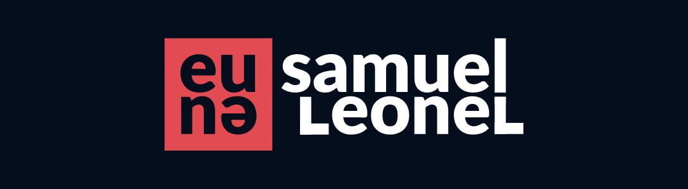

<div align="center">
  
</div>

<a id="sobre"></a>

## :book: Sobre

**Meu portfólio** é um meio de comunicação para as pessoas leigas e até mesmo as mais experts no assunto que buscam alguém para desenvolver soluções com foco no front-end. Lá você pode encontrar os principais projetos que fiz e também conhecer um pouquinho mais sobre mim. Gostou desse Readme? Que tal a gente bater um papo?

<a id="tecnologias-utilizadas"></a>

## :rocket: Tecnologias Utilizadas

O projeto foi desenvolvido utilizando as seguintes tecnologias:

- [Nuxt](https://nuxtjs.org/)

<a id="como-usar"></a>

## :fire: Como Usar

### Pré-requisitos

- [Node.js](https://nodejs.org/);
- [NPM](https://www.npmjs.com/get-npm) ou [Yarn](https://classic.yarnpkg.com/pt-BR/docs/install/);


1.  Faça um clone:

```shell
$ git clone https://github.com/samuel-lf/Portfolio.git
```

3. Executando o projeto:

```
# Instale as dependências
$ npm install

# Inicie a aplicação web
$ npm run dev
```

4. Build da aplicação:

```
# Gerar o build da aplicação
$ npm run generate
```

<h5 align="center">

  Feito com :heart: por <a href="https://www.linkedin.com/in/samuel-leonel-4a9ab7130/" target="_blank">Samuel Leonel</a>
</h5>
